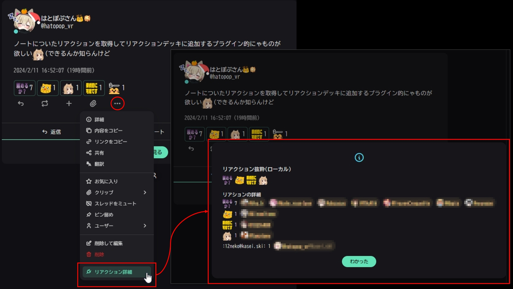

# misskey-note-reaction-viewer-plugin
特定のノートにリアクションをつけたユーザーの一覧を簡易に表示するMisskeyプラグインです。
[AiScript](https://github.com/syuilo/aiscript/tree/master)によって記述されています。

## 使い方

- 該当のノートの`･･･`メニューからプラグインボタン`リアクション詳細`を選択すると、リアクションを取得し、ダイアログウインドウで表示します。

## 導入

1. [`release`](https://github.com/hatopopvr/misskey-note-reaction-viewer-plugin/releases)から`MisskeyNoteReactionViewer.is`をダウンロードします。
2. ダウンロードした内容を全てコピーします。
3. Misskeyの`設定 > プラグインのインストール`のテキストエリアに貼付けます。
4. `インストール`ボタンを押します。

## 作者
[@hatopop_vr@misskey.io](https://misskey.io/@hatopop_vr)